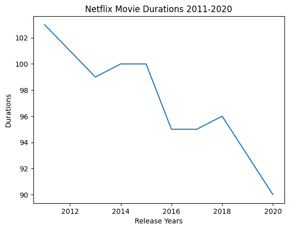
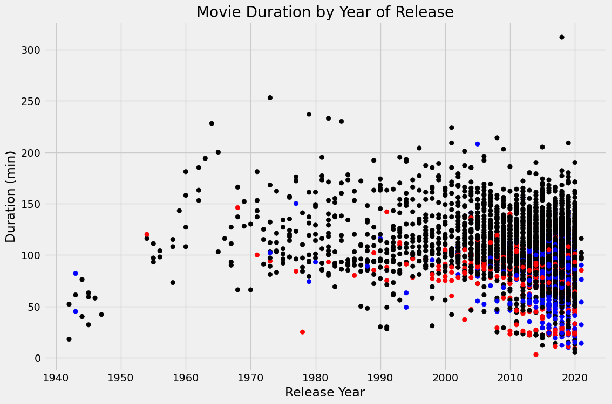

# INVESTIGATING NETFLIX MOVIES

## Test 1
Use our friend's data to create a dictionary. To do so, you will need to perform the following
steps.
- Create a list of years from 2011 to 2020 and a list durations of the average movie
lengths our friend provided (103, 101, 99, 100, 100, 95, 95, 96, 93, and 90).
- Create a dictionary movie_dict, with the keys "years" and "durations" and the
values set to your lists years and durations.
- Print and inspect the dictionary to ensure it was created correctly

```python
#Create the years and durations lists
years = [2011,2012,2013,2014,2015,2016,2017,2018,2019,2020]
durations = [103,101,99,100,100,95,95,96,93,90]

#Create a dictionary with the two lists
movie_dict = {
    "years" : years,
    "durations": durations
}

# Print the dictionary
movie_dict
```

## Task 2
- Import pandas using its usual alias, pd.
- Create a DataFrame durations_df using your movie_dict dictionary you created in the previous step.
- Print the entire DataFrame.
  
```python
# Import pandas under its usual alias
import pandas as pd

# Create a DataFrame from the dictionary
durations_df = pd.DataFrame(movie_dict)

# Print the DataFrame
print(durations_df)
```

## Task 3
- Import matplotlib.pyplot under the alias plt.
- Create a line plot of the data with the years column of durations_df on the x- axis, and the durations column on the y-axis.
- Add the title "Netflix Movie Durations 2011-2020" to your plot.

```python
# Import matplotlib.pyplot under its usual alias and create a figure
import matplotlib.pyplot as plt

fig = plt.figure()

# Draw a line plot of release_years and durations
plt.plot(durations_df["years"],durations_df["durations"])
plt.xlabel("Release Years")
plt.ylabel ("Durations")

# Create a title
plt.title ("Netflix Movie Durations 2011-2020")

# Show the plot
plt.show()
```



## Task 4
- Create another DataFrame, netflix_df, this time using the CSV file our friend provided us with, available at the path "datasets/netflix_data.csv".
- Print the first five rows of the DataFrame to inspect the data and ensure it was created successfully.

 ```python
 # Read in the CSV as a DataFrame
netflix_df = pd.read_csv("netflix_data.csv")

# Print the first five rows of the DataFrame
netflix_df.head(5)
```

## Task 5
- Subset the netflix_df DataFrame such that only rows where the type is a "Movie" are preserved. Assign the result to netflix_df_movies_only.
- Subset the netflix_df_movies_only DataFrame to preserve only the columns title, country, genre, release_year, and duration. Assign the result to netflix_movies_col_subset.
- Print the first five rows of netflix_movies_col_subset.

```python
# Subset the DataFrame for type "Movie"
netflix_df_movies_only = netflix_df[netflix_df["type"]=="Movie"]

# Select only the columns of interest
netflix_movies_col_subset = netflix_df_movies_only[['title','country','genre','release_year','duration']]

# Print the first five rows of the new DataFrame
print(netflix_movies_col_subset.head())
```

## Task 6
- Using your netflix_movies_col_subset DataFrame, create a scatter plot, placing the release_year on the x-axis and the movie duration on the y-axis.
- Add a title to your plot: "Movie Duration by Year of Release".
- Show the plot.

```python
# Create a figure and increase the figure size
fig = plt.figure(figsize=(12,8))

# Create a scatter plot of duration versus year
plt.scatter(netflix_movies_col_subset["release_year"],netflix_movies_col_subset["duration"])
plt.xlabel("Release Year")
plt.ylabel("Duration")
# Create a title
plt.title("Movies Duration by Year of Release")

# Show the plot
plt.show()
```


## Task 7
- Subset netflix_movies_col_subset to create a new DataFrame short_movies containing only movies that have a duration fewer than 60 minutes.
- Print the first 20 rows of short_movies to get a good overview of the types of films with a short duration.

```python
# Filter for durations shorter than 60 minutes
short_movies = netflix_movies_col_subset[netflix_movies_col_subset["duration"]<60]

# Print the first 20 rows of short_movies
short_movies.head(20)
```

## Task 8
- Initialize an empty list called colors to store our different color values.
- Use a for loop to iterate through the netflix_movies_col_subset DataFrame's rows and append colors to your colors list based on the following conditions:
  - If the genre is "Children", append "red".
  - If the genre is "Documentaries", append "blue".
  - If the genre is "Stand-Up", append "green".
  - If the genre is any other genre, append "black".
- Print the first 10 values of your colors list to inspect the results.
  
```python
  # Define an empty list
colors = []

# Iterate over rows of netflix_movies_col_subset
for lab, row in netflix_movies_col_subset.iterrows():
    
    if row['genre'] == "Children":
        colors.append("red")
        
    elif row['genre'] == "Documentaries":
        colors.append("blue")
        
    elif row['genre'] == "Stand-up":
        colors.append("green")
    
    else:
        colors.append("black")
        
# Inspect the first 10 values in your list        

print(colors[:11])
```

## Task 9
- Using the data contained in netflix_movies_col_subset, plot the same scatter plot as you did in Task 6, but with a few modifications:
- Color the points on the scatter plot using your colors list you defined in the previous step.
- Add a title "Movie duration by year of release", an x-axis label "Release year", and a y-axis label "Duration (min)".
- Show the plot.
  
```python
# Set the figure style and initalize a new figure
plt.style.use('fivethirtyeight')
fig = plt.figure(figsize=(12,8))

# Create a scatter plot of duration versus release_year
plt.scatter(netflix_movies_col_subset["release_year"],netflix_movies_col_subset["duration"],c=colors)

# Create a title and axis labels
plt.xlabel("Release Year")
plt.ylabel("Duration (min)")
plt.title("Movie Duration by Year of Release")

# Show the plot
plt.show()
```



  
## Task 10
- Provide your answer to the question "Are we certain that movies are getting shorter?" in the form of a string

```python
# Are we certain that movies are getting shorter?
are_movies_getting_shorter = "we can't say that all movies are getting shorter in one word but we can conclude that more short movies are produced lately"
```
  
